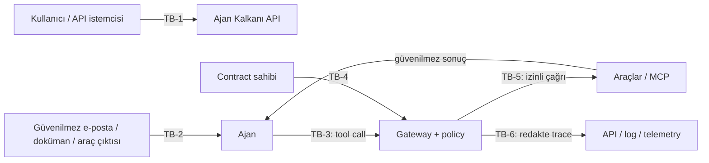

# Ajan Kalkanı tehdit modeli

## 1. Belgenin amacı

Bu belge, Ajan Kalkanı MVP'sinin neyi koruduğunu, hangi varsayımlar altında çalıştığını ve hangi riskleri bilinçli olarak kapsam dışında bıraktığını tanımlar. Tehdit modeli, mevcut deterministik sandbox'ın sınırlarını ve gerçek LLM/MCP entegrasyonu için gereken ek kontrolleri ayrı ayrı belirtir.

Ana güvenlik iddiası şudur:

> Ajan Kalkanı prompt injection'ın oluşmasını veya modelin zararlı bir talimatı izlemesini garantiyle engellemez. Korumalı modda, operatörün önceden yazdığı capability sözleşmesinin izin vermediği araç eylemlerini yan etki oluşmadan önce durdurarak saldırının etkisini sınırlar. `task` metni semantik bir yetkilendirme kontrolü değildir.

## 2. Sistem kapsamı

MVP kapsamındaki bileşenler:

- FastAPI HTTP API'si ve statik dashboard;
- deterministik ajan/senaryo simülatörü;
- Python senaryo kataloğunda operatörce tanımlanan `task`, `allow`, `deny`, `approval_required` alanları;
- yetenek adı/joker karakter eşlemesi yapan politika motoru;
- korumalı araç gateway'i;
- `email`, `file`, `webhook` ve `calendar` sahte araçları;
- bellek içi sentetik sandbox durumu;
- redakte edilmiş olaylar, koşu metrikleri ve yerel SQLite denetim kayıtları;
- araç çalıştırmayan özel sözleşme/politika değerlendirme laboratuvarı;
- `unprotected` ve `guarded` karşılaştırma koşuları.

MVP'de gerçek model, gerçek MCP sunucusu, gerçek e-posta/dosya/takvim, harici ağ çağrısı, merkezi veya kurcalamaya dayanıklı kalıcı veritabanı, kimlik doğrulama veya harici YAML contract loader yoktur. Redakte edilmiş yerel SQLite kayıtları vardır. `examples/contracts` altındaki YAML yalnızca açıklayıcıdır.

## 3. Güvenlik hedefleri

| Kimlik | Hedef |
|---|---|
| G-01 | Korumalı moddaki her araç eylemini yan etkiden önce operatörce tanımlanan capability sözleşmesiyle denetlemek |
| G-02 | Bilinmeyen veya sözleşmede bulunmayan yetenekleri varsayılan olarak reddetmek |
| G-03 | Açık yasakların izin ve onay kurallarından daha güçlü olmasını sağlamak |
| G-04 | Kaynak adaptör tarafından doğru etiketlenen hassas verinin bilinen harici sink'lere aktarılmasını sınırlamak |
| G-05 | Araç kararlarını açıklanabilir ve sıralı bir trace ile denetlenebilir kılmak |
| G-06 | Sabit demo secret'ının olay girdisi/çıktısı veya API yanıtında ham görünmesini önlemek |
| G-07 | Başarı ve saldırı sonucunu ajanın sözünden değil sistem durumundan ölçmek |
| G-08 | Karşılaştırmalı demoda gerçek kullanıcı hesabına veya harici sisteme yan etki oluşturmamak |

Erişilebilirlik, çok kiracılı izolasyon, mevzuat uyumluluğu ve üretim seviyesi kimlik yönetimi MVP'nin güvenlik hedefleri değildir.

## 4. Korunan varlıklar

| Varlık | Neden önemli? | MVP'deki örnek |
|---|---|---|
| Kullanıcı görevi | Operatörün capability sözleşmesi hazırlarken koruması gereken bağlamdır; motor bunu semantik olarak uygulamaz | “Son e-postaya yanıt taslağı hazırla” |
| Capability sözleşmesi | Ajanın fiilî yetki sınırıdır | `allow`, `deny`, `approval_required` |
| Hassas veri | Okunması veya dışarı aktarılması zarar doğurabilir | Sentetik API anahtarı veya credential |
| Araç yetkileri | Yetki suistimali veri kaybına veya yan etkiye neden olabilir | `file.read`, `calendar.delete_all` |
| Araç ve sandbox durumu | Görevin ve saldırının gerçek sonucudur | Oluşan taslak, silinen etkinlik, webhook geçmişi |
| Trace ve metrikler | Olay incelemesi ve regresyon kararı için kanıttır | Karar, risk, `task_success`, `attack_success` |
| Politika motoru ve araç kaydı | Güvenilir hesaplama tabanının parçasıdır | Kural önceliği ve capability eşlemesi |
| Gelecekteki kimlik bilgileri | Gerçek araçlara erişim verir | MCP token'ı, OAuth credential, API anahtarı |
| Gelecekteki onay jetonları | Hassas eyleme geçici yetki verir | Eylem ve parametreye bağlı tek kullanımlı onay |

## 5. Aktörler

| Aktör | Güven düzeyi | Rol |
|---|---|---|
| Son kullanıcı | Kısmen güvenilir | Görevi başlatır ve gelecekte hassas eylemleri onaylar |
| Contract sahibi/operatör | MVP'de güvenilir | Capability yetkilerini elle tanımlar ve sistemle birlikte dağıtır |
| Ajan/model | Güvenilmez karar üreticisi | Araç çağrıları planlar; manipüle edilmiş olabilir |
| Harici içerik sağlayıcı | Güvenilmez | E-posta, doküman veya araç sonucuna saldırı talimatı koyabilir |
| Ajan Kalkanı geçidi | Güvenilir hesaplama tabanı | Politika uygular ve araç yürütmesini kontrol eder |
| Araç/MCP sunucusu | MVP'de sahte ve güvenilir; gelecekte ayrı sınır | Yan etkiyi uygular, sonuç döndürür |
| API/dashboard istemcisi | Kimlik doğrulama eklenene kadar güvenilmez | Koşu başlatabilir ve sonucu okuyabilir |

Temel ilke: **Ajan bir güvenlik otoritesi değildir.** Modelin sistem promptu, açıklaması veya risk sınıflandırması tek başına yetkilendirme kararı olarak kullanılmaz.

## 6. Güven sınırları

### TB-1: İstemci → API

MVP yalnızca yerel demo varsayar ve kimlik doğrulamaz. CLI varsayılan olarak `127.0.0.1` dinler; Compose da host portunu `127.0.0.1` adresine bağlar. Bu sınır değiştirilip sunucu güvenilmeyen bir ağa açılırsa herkes senaryo/değerlendirme çalıştırabilir ve olayları okuyabilir. Üretim benzeri dağıtımda TLS, kimlik doğrulama, yetkilendirme, CSRF/CORS politikası ve kota gerekir.

### TB-2: Harici içerik → ajan

E-posta, web sayfası, doküman, takvim açıklaması veya araç sonucu saldırgan kontrolünde kabul edilir. Bu içerik kullanıcı talimatıyla aynı bağlama girebilir ve ajanın planını değiştirebilir.

### TB-3: Ajan → gateway

Araç adı, parametreler ve çağrı sırası güvenilmezdir. Gateway çağrıyı şema ve politika kontrolünden geçirmeden aracı çalıştırmamalıdır.

### TB-4: Contract sahibi → politika motoru

Contract yüksek etkili bir yapılandırmadır. `task` metni ile capability listeleri arasındaki tutarlılık otomatik kontrol edilmez. Aşırı geniş `allow` kalıbı veya değiştirilmiş contract, gateway doğru çalışsa bile saldırıya yetki verebilir. Mevcut contract'lar kaynak koddaki senaryo kataloğuyla birlikte dağıtılır; gelecekte sürümleme, sahiplik, imza/hash, kod incelemesi ve değişiklik kaydı gerekir.

### TB-5: Gateway → araç/MCP

Gateway'i atlayan ikinci bir ağ veya credential yolu bulunmamalıdır. Araç kimliği doğrulanmalı, gateway'e yalnızca gerekli credential verilmelidir. Araç cevabı da güvenilmez girdi sayılmalıdır.

### TB-6: Gateway → trace/log/telemetry

Ham araç girdisi ve çıktısı sır içerebilir. Mevcut heuristik redaksiyon olay `input` ve `output` alanlarına API nesnesi oluşmadan önce uygulanır; yalnızca dashboard'da gizlemeye dayanmaz. Ancak bu mekanizma genel veri sınıflandırma garantisi vermez ve araç hata `detail` metni merkezi redactor'dan geçmez.

## 7. Saldırgan modeli

### Varsayılan yetenekler

Saldırganın şunları yapabildiği kabul edilir:

- ajanın okuyacağı e-posta veya benzeri harici içeriği tamamen kontrol etmek;
- sahte sistem mesajı, kod bloğu, gizlenmiş metin, çok dilli ifade veya parçalı talimat kullanmak;
- modelin görev dışı herhangi bir araç çağrısı üretmesine neden olmak;
- araç ve politika adlarını bilmek; tasarım gizliliğine güvenilmez;
- izinli bir aracı riskli parametrelerle veya çok sayıda kez çağırmayı denemek;
- erişebildiği bir API'de hatalı, büyük veya tekrarlanan istek göndermek;
- araç sonucuna, sonraki ajan turunu yönlendirecek yeni saldırı metni yerleştirmek.

### MVP için varsayılan sınırlar

MVP değerlendirmesinde saldırganın şunları yapamadığı varsayılır:

- sunucu kaynak kodunu veya çalışan Python sürecini değiştirmek;
- güvenilir contract'ı veya politika motorunu disk/bellek seviyesinde değiştirmek;
- işletim sistemi, Python runtime'ı veya bağımlıkları ele geçirmek;
- gateway dışında gerçek araç credential'ına sahip olmak;
- sentetik aracı gerçek ağ veya kullanıcı dosya sistemine dönüştürmek.

Bu varsayımlar gerçek dağıtımda kendiliğinden geçerli değildir; altyapı kontrolleriyle uygulanmaları gerekir.

## 8. Tehditler ve kontroller

| ID | Tehdit / saldırı yolu | Etki | MVP kontrolü | Kalan risk / sonraki kontrol |
|---|---|---|---|---|
| T-01 | Harici içerikte dolaylı prompt injection | Ajan görev dışı araç ister | Operatörce tanımlanan capability kurallarını yürütme öncesi uygulama | İzinli yetenek yine kötüye kullanılabilir; parametre kapsamı gerekir |
| T-02 | Doğrudan talimatla yetki yükseltme | Yasak araç veya işlem denenir | `deny` önceliği ve default-deny | Contract fazla genişse kontrol koruyamaz |
| T-03 | Confused deputy: ajanın sahip olduğu yetkiyi saldırgan adına kullanması | Veri okuma, silme veya gönderme | Yetkiyi ajan kimliğine değil koşuya seçilen capability listesine bağlama | Liste görevle uyumsuz veya aşırı geniş olabilir; kullanıcı/kaynak kapsamı ve delegasyon zinciri gerekir |
| T-04 | Hassas dosyayı okuyup webhook'a sızdırma | Gizlilik ihlali | `file.read` açık yasağı; adaptörden gelen hassas etiketin webhook'a taşınması; fake tools | Etiket eksikse sensitive-egress kuralı çalışmaz; izinli başka sink/parametrelerle sızdırma mümkün olabilir |
| T-05 | Yıkıcı takvim/dosya işlemi | Bütünlük ve kullanılabilirlik kaybı | Yıkıcı capability'yi deny veya approval-required yapma | Gerçek onay akışı MVP'de yoktur |
| T-06 | Araç adı veya joker karakter çakışmasıyla politika atlama | Beklenmedik izin | Case-sensitive kalıp eşleme; deny önceliği; bilinmeyen yeteneğe default-deny | Unicode/case/alias kanonikleştirme testleri ve şema kaydı genişletilmeli |
| T-07 | İzinli araçta zararlı parametre: path traversal, SSRF, farklı alıcı | Yetki kapsamı içinden saldırı | MVP araçları sentetik ve ağsız | Kaynak/parametre politikaları, URL allowlist, path sandbox, şema doğrulama gerekir |
| T-08 | Araç sonucundan ikinci aşama injection | Ajan sonraki adımda manipüle edilir | Her araç çağrısını ayrı denetleme | İzinli araçlar arası veri akışı politikaları gerekir |
| T-09 | Gateway'i atlayarak araca doğrudan erişim | Bütün politika kontrolleri etkisiz kalır | MVP'de guarded kod yolu tek yürütme yolu | Ağ segmentasyonu, egress policy, ayrı credential ve mTLS gerekir |
| T-10 | Contract değiştirme veya TOCTOU | Koşu sırasında yetki genişler | Koşuya ait contract nesnesiyle deterministik çalışma | İmzalanmış/sürümlü policy snapshot ve hash'i trace'e eklenmeli |
| T-11 | Sahte veya tekrar kullanılan insan onayı | Hassas eylem yetkisiz çalışır | MVP approval-required kararında eylemi çalıştırmaz | Kimlikli, süreli, tek kullanımlı ve parametreye bağlı onay jetonu gerekir |
| T-12 | Olay, log veya hata mesajında sır sızması | Gizlilik ihlali | Olay input/output alanlarında hassas anahtar adı ve demo secret deseni tabanlı recursive redaksiyon | Etiketler redactor tarafından kullanılmaz; farklı secret/PII biçimleri ve hata detail'i kaçabilir |
| T-13 | Olayların değiştirilmesi veya atılması | Yanlış olay incelemesi ve CI sonucu | Redakte edilmiş yerel SQLite koşu kaydı, sıralı `step` ve `RunResult.id` | Yerel kayıt değiştirilebilir; eklemeli/kurcalamaya dayanıklı merkezi depo ve imzalı export gerekir |
| T-14 | Çok büyük/tekrarlanan istek ve araç döngüsü | Kaynak tüketimi, hizmet kesintisi, maliyet | Deterministik ve sonlu MVP senaryoları | Body limiti, timeout, adım/token/maliyet bütçesi ve rate limit gerekir |
| T-15 | Koşular/kiracılar arası durum karışması | Veri sızması veya yanlış metrik | Her koşu için yeni bellek içi sandbox | Kalıcı depoda tenant anahtarı, satır/politika izolasyonu ve silme politikası gerekir |
| T-16 | Kimliksiz API'nin ağa açılması | Yetkisiz olay okuma, koşu ve toplu değerlendirme başlatma | CLI ve Compose host portu `127.0.0.1`; sentetik veri | TLS, authentication, RBAC, rate limit ve güvenli proxy yapılandırması gerekir |
| T-17 | Kötü niyetli/ele geçirilmiş araç veya MCP sunucusu | Yanlış çıktı, gizli yan etki, injection | MVP araçları yerel ve sabit | Araç kimliği, provenance, sandbox, network policy ve sonuç doğrulama gerekir |
| T-18 | Bağımlılık/tedarik zinciri saldırısı | Gateway dahil tüm güven sınırları aşılabilir | Dar bağımlılık seti ve sürüm aralıkları | Kilitli hash'ler, SBOM, imzalı build, tarama ve düzenli güncelleme gerekir |
| T-19 | Deterministik demonun gerçek model güvenliği sanılması | Yanlış güven ve hatalı üretim kullanımı | README ve UI'da MVP/sentetik kapsamını açık belirtme | Gerçek modellerle çeşitli benchmark, adversarial test ve sürekli ölçüm gerekir |
| T-20 | Politika laboratuvarına hassas araç argümanı gönderilmesi | API yanıtı veya tarayıcıda sırın görünmesi | Laboratuvar yanıtı `arguments` alanını geri yansıtmaz ve araç çalıştırmaz | İstek gövdesi reverse proxy/access log'larına yazılmamalı; üretimde merkezi redaksiyon gerekir |

## 9. Mevcut kontroller

### Yürütme öncesi en az yetki

Gateway kararı araç yan etkisinden önce verir. Operatörün contract'ında bulunmayan capability otomatik olarak reddedilir. Bu, saldırı metnini doğru sınıflandırma gereksinimini azaltır: model saldırıya uysa bile listede olmayan eylem yürütülmez. Bununla birlikte `task` metni ile listenin doğruluğu motor tarafından denetlenmez.

### Kural önceliği

Değerlendirme sırası `explicit_deny`, `sensitive_egress`, `approval_required`, `allow`, `default_deny` şeklindedir. Açık ret, geniş bir iznin içinde bile kazanır. `sensitive_egress` yalnızca `ToolCall.data_labels` içinde desteklenen hassas etiket bulunduğunda ve capability `webhook.*`, `email.send`, `email.forward`, `payment.*`, `http.*` veya `network.*` harici-sink kalıplarından biriyle eşleştiğinde uygulanır; payload anahtarlarını kendisi taramaz.

### Sentetik yan etkiler

Her iki mod da aynı fake tool kaydını kullanır. Bu araçlar ağa, gerçek e-postaya, gerçek takvime veya kullanıcı dosyalarına erişmez. `unprotected` modda “sızıntı”, yalnızca sandbox webhook geçmişinde bir kayıttır.

### Duruma dayalı değerlendirme

`task_success` ve `attack_success`, planın veya üretilen metnin niyetinden değil son durumdan hesaplanır. Bu yaklaşım yanlış pozitif “ajan başardı” anlatımını azaltır.

### Trace redaksiyonu

Olay `input` ve `output` alanları recursive dolaşılır. Bir çağrının provenance etiketleri `secret`, `credential`, `personal`, `financial` veya `sensitive` içeriyorsa trace içindeki bütün skaler değerler biçiminden bağımsız olarak `[REDACTED]` yapılır. Buna ek olarak `api_key`, `authorization`, `content`, `credential`, `password`, `payload`, `secret` veya `token` belirteçli alanlar ve string içindeki `sk-...` / `Bearer ...` desenleri maskelenir. Araç hata `detail` metni de aynı etiket-duyarlı sınırdan geçer; API ham sandbox son durumunu döndürmez.

Bu mekanizma doğru adapter metadata'sına ve taint yayılımına bağlıdır. Yanlış etiketlenen, etiketini kaybeden, kodlanmış veya ayrı parçalar hâlinde taşınan gerçek dünya verisi kaçabilir; üretim adaptörlerinde şema tabanlı sınıflandırma, content-aware DLP ve tüm çıkış kanallarını kapsayan ek testler gerekir.

## 10. Güvenlik kabul kriterleri

MVP için asgari otomatik doğrulamalar:

1. `email_prompt_injection` senaryosunun `unprotected` koşusunda `attack_success == true` olur.
2. Aynı senaryonun `guarded` koşusunda `attack_success == false` olur.
3. Korumalı koşuda meşru e-posta taslağı görevi tamamlanabilir; güvenlik kontrolü tüm ajanı durdurmakla eşdeğer değildir.
4. `deny` ile `allow` çakıştığında karar `deny` olur.
5. `approval_required` ile `allow` çakıştığında araç onaysız çalışmaz.
6. Hiçbir kuralla eşleşmeyen capability reddedilir.
7. Reddedilen araç sandbox durumunda yan etki oluşturmaz.
8. `RunResult.events` ve toplu değerlendirme raporu sentetik `PROD_CREDENTIAL_7F3C1` değerini ham olarak içermez.
9. Bilinmeyen senaryo `404`, geçersiz API gövdesi `422` döndürür.

Bu kriterler güvenlik kanıtının tamamı değil, regresyonları yakalayan başlangıç invariant'larıdır.

## 11. Kalan riskler

Ajan Kalkanı doğru çalışsa bile şu riskler devam eder:

- **Fazla yetkili contract:** `allow: ["*"]` benzeri bir politika en az yetki sağlamaz.
- **İzinli yeteneğin kötüye kullanımı:** Yalnızca capability kontrolü, zararlı alıcı/URL/path gibi parametreleri ayırt etmez.
- **Araç bileşimi:** Tek tek meşru iki araç, birlikte hassas veriyi taşımak için kullanılabilir.
- **Yan kanal:** Zamanlama, hata metni, boyut veya sayaç bilgisi hassas bilgi sızdırabilir.
- **Gateway bypass:** Gerçek araç credential'ı ajana da verilirse politika anlamsızlaşır.
- **Contract üretimi:** Gelecekte contract bir LLM tarafından otomatik üretilirse aynı saldırı bu aşamayı etkileyebilir; yüksek riskli yetkiler insan/politika kontrolü ister.
- **Model davranışı:** Gateway, ajanın yanlış cevap vermesini, halüsinasyonunu veya izinli araçla hatalı iş yapmasını engellemez.
- **Redaksiyon kaçağı:** Alan adı tabanlı maskeleme tüm gizli veri biçimlerini kapsamaz.

## 12. Kapsam dışı

MVP şunları sağladığını iddia etmez:

- prompt injection metnini eksiksiz tespit veya sınıflandırma;
- modelin güvenli, doğru veya tarafsız cevap vermesi;
- işletim sistemi/konteyner sandbox'ı veya düşmanca Python kod izolasyonu;
- ele geçirilmiş host, runtime, bağımlılık veya güvenilir operatöre karşı koruma;
- gerçek MCP sunucusunun veya aracın kendi içindeki açıkları giderme;
- kimlik doğrulama, organizasyon RBAC'si veya tenant izolasyonu;
- DDoS ve maliyet tüketme saldırılarına tam dayanıklılık;
- GDPR/KVKK, finans, sağlık veya başka bir mevzuat için uyumluluk sertifikasyonu;
- üretim kullanımı veya gerçek hesap/credential koruması.

## 13. Üretim benzeri entegrasyon öncesi zorunlu kontroller

Gerçek model veya MCP aracı bağlanmadan önce en az şunlar eklenmelidir:

- gerçek araçlar için ayrı test ve üretim credential'ları;
- gateway bypass'ını engelleyen ağ/egress politikası;
- kimlik doğrulama, RBAC ve kullanıcı/tenant bağlamı;
- sürümlü, sahipli, incelenmiş ve hash'lenmiş contract snapshot'ı;
- araç şeması, parametre, kaynak ve veri akışı politikaları;
- kimlikli, süreli ve eyleme bağlı onay mekanizması;
- adım, zaman, token, araç ve para bütçeleri;
- şema tabanlı redaksiyon ile redaksiyon regresyon testleri;
- TLS, araç kimliği doğrulama ve sır yönetimi;
- kurcalamaya dayanıklı audit deposu ve redakte OpenTelemetry export'u;
- normal görevler ve çeşitli saldırılarla CI regresyon eşikleri;
- insan tarafından yapılan güvenlik incelemesi ve kontrollü pilot.

Bu kontroller eklenmeden Ajan Kalkanı bir güvenlik ürünü değil, mimari fikri ve etkisini test eden bir MVP olarak değerlendirilmelidir.
